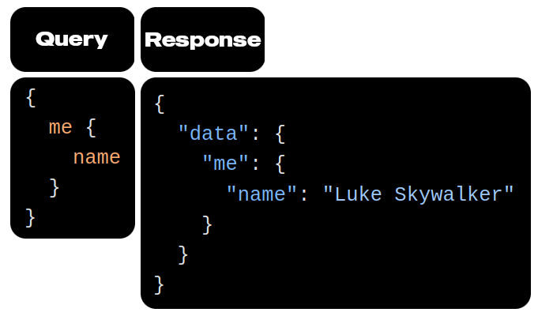
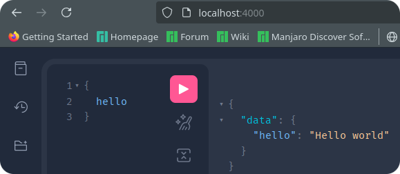

# Graph QL

- A [query language](./glossary.md#queryLanguageDefinition) for your API.
- A [server-side runtime](./glossary.md#serverSideRuntimeDefinition) for executing queries using a [type system](./glossary.md#typeSystemDefinitionInGraphql) you define for your data.
- The [GraphQL **specification**](https://spec.graphql.org) is open-source.
- [GraphQL is not tied to any specific database or storage engine](https://www.reddit.com/r/graphql/comments/1gr13y6/why_graphql_is_phrasing_being_databaseagnostic_as/?utm_source=share&utm_medium=web3x&utm_name=web3xcss&utm_term=1&utm_content=share_button) -- it is backed by your existing code and data.

## My definition of GraphQL

GraphQL is a structured way of talking to the backend and asking for data or performing an operation in a specific way within the established framework of our backend. Meaning we ain't gonna let client to do whatever they want but will give them more room to play but will still have some form dos and don'ts.

## How you create your API in GraphQL

A GraphQL service (AKA GraphQL backend) is created by:

1. **Defining types** and their fields.
2. Writing **a function for each field to provide the required data**.


## Sales pitches of GraphQL

### Query what you need

A GraphQL service is running (typically at a URL on a web service):

1. It receives _GraphQL queries_ to validate and execute from clients.
2. The service first checks a query to ensure it only refers to the types and fields defined for the API.
3. Then runs the provided functions to produce a result.



> [!NOTE]
>
> Client can make queries to the API that mirror the structure of the data that they need and then receive just that data in the expected shape with a single request.

### No need to do API versioning

- Change your API based on ever evolving client needs without the overhead of managing different API versions.
- E.g. we've got a new feature to develop. Like when you wanna display more info about user on their profile. Thus `User` type could be updated as follows:

  ```graphql
  type User {
    fullName: String
    nickname: String
    name: String @deprecated(reason: "Use `fullName`.")
  }
  ```

  So here is a break down of what will happen next:

  1. Our client can still use `name` in their codebase.
  2. They can see that `name` is flagged as deprecated.
  3. They refactor their code to use `fullname` instead.
  4. We're sure that nobody is using `name` anymore. Thus we get rid of it entirely.

Here is another example of fetching user info when we are only interested in user's `name`, `id` and `appearsIn`.


## Hello world app ;)

1. `pnpm add graphql`
2. Define a schema for your GraphQL service.
   - This is where we define our `Query` type.
3. Define root API (AKA root resolver).
   - Defines functions that correspond to the top-level fields in the `Query` type of the schema.
4. Define the query.
5. Make a call to your GraphQL.

Code: https://github.com/kasir-barati/graphql/blob/main/apps/hello-world/src/main.ts

## ExpressJS + GraphQL

1. `pnpm add "express@>=5.0.1" graphql-http graphql`.
2. `nx g @nx/express:application apps/expressjs-hello-world`.
   - `pnpm rm @nx/web @nx/webpack @pmmmwh/react-refresh-webpack-plugin @svgr/webpack webpack-cli react-refresh`.
   - Remove webpack plugin from `nx.json`. And from `project.json` + its files.
   - `nx add @ns/esbuild`.
   - Update your `project.json` to use esbuild instead of webpack.
3. ExpressJS to run a web server.
4. `graphql-http` lib to mount a GraphQL API server on the `/graphql` HTTP endpoint.
5. `pnpm add ruru`.

   - GraphiQL is GraphQL's IDE.
   - You can query and explore your GraphQL API with it.

   

Code: https://github.com/kasir-barati/graphql/tree/main/apps/expressjs-hello-world
