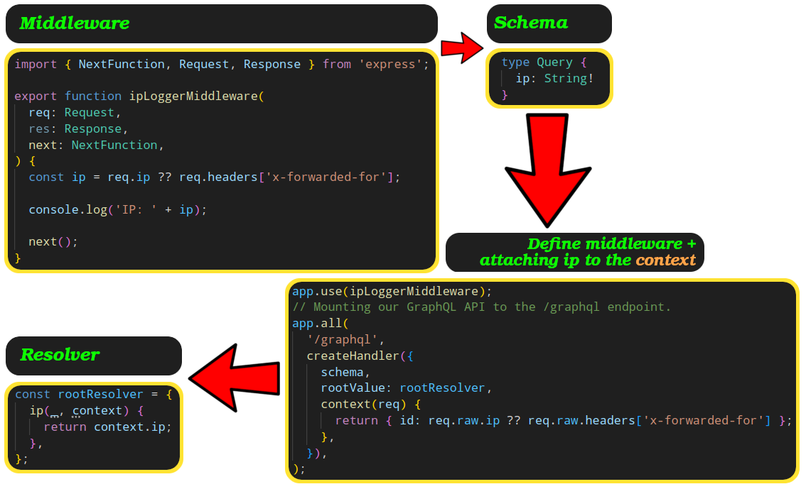

# Authentication

- Easiest way to implement auth in GraphQL service is to use `graphql-http` + middlewares.`
- Do it like you do normally in your ExpressJS or NestJS app inside a middleware.
- The `request` object is accessible as the second arg in your resolver.
- E.g. to access IP in your resolver you can follow these steps:

  

- And for securing your GraphQL with JWT we have a couple of options:
  - [PassportJS](https://www.passportjs.org/).
  - [express-js](https://github.com/auth0/express-jwt).
  - [expressjs-session](https://github.com/expressjs/session).

Code: [https://github.com/kasir-barati/graphql-js-ts/tree/main/apps/profile](https://github.com/kasir-barati/graphql-js-ts/tree/main/apps/profile).

## Ref

- [https://graphql.org/graphql-js/authentication-and-express-middleware/](https://graphql.org/graphql-js/authentication-and-express-middleware/).
