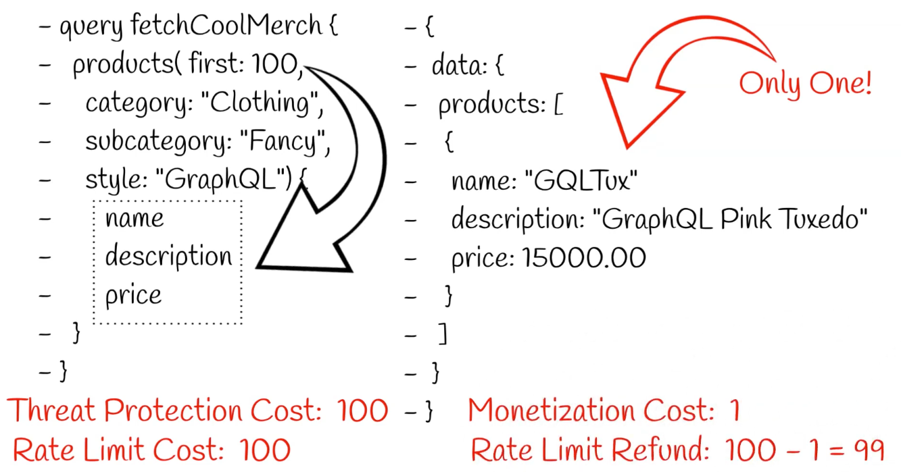

# Cost Analysis

<a href="#whyWeNeedCostAnalysis" id="whyWeNeedCostAnalysis">#</a> When we have a public API we need to take care of:

  
Threat protection

  
Make sure that client ain't asking for too much response data. You can find an example of this <a href="../security.md#denial-of-service-attack">here</a>

  
Rate limiting

  
How many transactions per second per consumer are allowed for each endpoint.

  
Monetization

  
Charge customers based on the weight of their API call.

## Potential Problem

In GraphQL our client can send a dramatically different kind of transactions. This means that for one query we might be able to process and return a response in less than a second but for another we might crash our entire backend **due to workload volume**!

> [!CAUTION]
>
> It is also possible that client might send a seemingly harmless not deep, not wide, not long query to our GraphQL service but in fact it is very expensive to run.

This brings us to the topic of this doc, **we cannot treat all queries the same in GraphQL**.

## Solution: Calculating Queries' Cost

By calculating each query's cost we can:

1. Prevent extremely heavy queries from being executed ([DoS protection](../security.md#denial-of-service-attack)).
2. Limit how many queries with a specific weight can be executed per second per consumer (rate limiting).
3. And we can charge more for heavy queries compare to light weight queries (monetization).

### Cost Analysis Methods

- 

    
Static query analysis

    
We calculate potentially how heavy this query execution might be.

    
  

- 

    
Dynamic query analysis

    
While the query is being executed on our server we calculate how heavy its execution was.

    
  

- 

    
Query response analysis

    
Calculates query's cost based on the response.

    
  

> [!NOTE]
>
> Why we have three different kind of cost analysis?
>
> Because we have [3 kind of need](#whyWeNeedCostAnalysis);
>
> 
>
> - We need to protect our GraphQL service from DoS attacks, thus we rely on how heavy one query might be.
> - For rate limiting we can:
>   - Rely on dynamic query analysis and deduct after execution.
>   - Deduct first based on the upper bound and then refund if we've deducted too much.
> - For monetization we can rely on dynamic query analysis.

#### Static Query Analysis

> [!CAUTION]
>
> It seems depth and complexity\* are two different things when it comes to tooling. But in the grand scheme of things the complexity of a query increases with the number of fields **AND the depth**.
>
> \*Query complexity refers to the computational resources needed to fulfill a query.
>
> Learn more about [query depth limiting here](https://youtu.be/b7OwR1gs-xA?si=MZa9DmNPTBU_VjW-).

- In NestJS we can do this in our [complexity estimator function](../nestjs.md#complexityEstimatorFunction).
- E.g., assume we're developing a GraphQL service for a bank and our client wanted to fetch the last 5 transactions of a user.

<table>
  <tr>
    <th>GraphQL Schema</th>
    <td>https://github.com/kasir-barati/graphql-js-ts/blob/e81e8883a9538af29ea0253849163677dce1fdf2/docs/best-practices/assets/fictional-back-graphql-schema.graphql#L1-L57</td>
  </tr>
  <tr>
    <th>Query</th>
    <td>https://github.com/kasir-barati/graphql-js-ts/blob/9a6c406b6b3d2d952970d0defb1957003ef49034/docs/best-practices/assets/fictional-back-graphql-schema.graphql#L59-L75</td>
  </tr>
  <tr>
    <th>Static Query Analysis</th>
    <td>
      <table>
        <caption>
          
Notes:
 
          <ul align="left">
            <li>
              <b>Type cost roughly corresponds</b> to how much data a query might produce.
            </li>
            <li>
              <b>Field cost corresponds</b> to how much work needs to be done fir a query to be processed by our GraphQL service.
            </li>
            <li>
              Note that field cost & type cost are upper bounds and not the actual final costs.
            </li>
            <li>
              We skip <code>scalar types</code> while calculating the cost of a query, but you can include it in case a specific scalar type is costly. <a href="./assets/static-query-analysis-skip-name.jpg">E.g. here we do not calculate <code>name</code> as a <i>field</i> in the <i>field counts</i></a>.
            </li>
            <li>
              Learn about <code>@listSize</code> directive <a href="https://ibm.github.io/graphql-specs/cost-spec.html#sec-The-List-Size-Directive">here</a>.
            </li>
          </ul>
        </caption>
        <tr>
          <th>Type Counts</th>
          <td>
            <table>
              <tr>
                <td>
                  <a href="./assets/static-query-analysis00.png"><code>Query</code>: <b>1</b></a>
                </td>
              </tr>
              <tr>
                <td>
                  <a href="./assets/static-query-analysis01.jpg"><code>Account</code>: <b>1</b></a>
                </td>
              </tr>
              <tr>
                <td>
                  <a href="./assets/static-query-analysis02.jpg"><code>TransactionConnection</code>: <b>1</b></a>
                </td>
              </tr>
              <tr>
                <td>
                  <a href="./assets/static-query-analysis03.jpg"><code>PageInfo</code>: <b>1</b></a>
                </td>
              </tr>
              <tr>
                <td>
                  <a href="./assets/static-query-analysis04.jpg"><code>TransactionEdge</code>: <b>5</b></a>
                </td>
              </tr>
              <tr>
                <td>
                  <a href="./assets/static-query-analysis05.jpg"><code>Transaction</code>: <b>5</b></a>
                </td>
              </tr>
            </table>
          </td>
        </tr>
        <tr>
          <th>Type Cost</th>
          <td>14</td>
        </tr>
        <tr>
          <th>Field Counts</th>
          <td>
            <table>
              <tr>
                <td>
                  <a href="./assets/static-query-analysis01.jpg"><code>Query.account</code>: <b>1</b>
                </td>
              </tr>
              <tr>
                <td>
                  <a href="./assets/static-query-analysis02.jpg"><code>Account.transactions</code>: <b>1</b>
                </td>
              </tr>
              <tr>
                <td>
                  <a href="./assets/static-query-analysis03.jpg"><code>TransactionConnection.pageInfo</code>: <b>1</b>
                </td>
              </tr>
              <tr>
                <td>
                  <a href="./assets/static-query-analysis04.jpg"><code>TransactionConnection.edges</code>: <b>1</b>
                </td>
              </tr>
              <tr>
                <td>
                  <a href="./assets/static-query-analysis05.jpg"><code>TransactionEdge.node</code>: <b>5</b>
                </td>
              </tr>
            </table>
          </td>
        </tr>
        <tr>
          <th>Field Cost</th>
          <td>9</td>
        </tr>
      </table>
    </td>
  </tr>
</table>

  
All the pictures related to the static query analysis in ascending order

  
  
  
  
  
  
  

TK: https://youtu.be/_WpM7qylvYg?si=rQFxNNj3CjWGc8Bf

# Ref

- https://mmatsa.com/blog/methods-of-cost-analysis.
- [Why GraphQL Cost Analysis](https://youtu.be/QZfmSDofeVg?si=w_5lZDHlJ9LUZCRE).
- [Methods of GraphQL Cost Analysis](https://youtu.be/EfRjeZxQFio?si=mGQyrLSypTyf4dWJ).
- [GraphQL Static Query Analysis Example](https://youtu.be/DkHNZOA3rM0?si=GnUEeYoCQyshI2n0).
- [APIDays Interface 2021 - Securing GraphQL with Cost Directives](https://youtu.be/_WpM7qylvYg?si=rQFxNNj3CjWGc8Bf).
