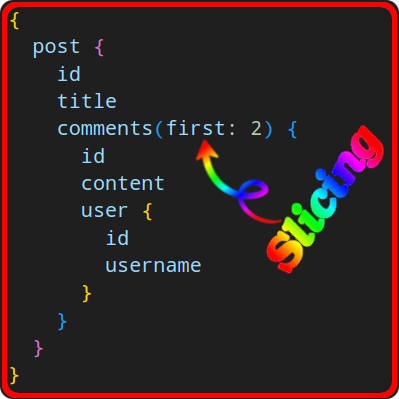
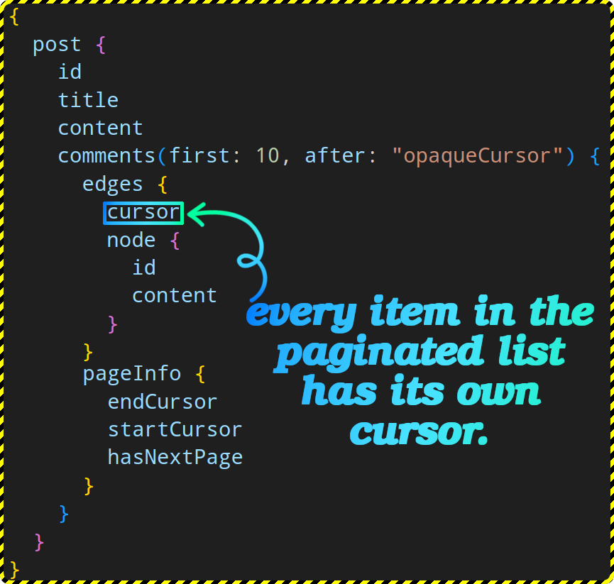
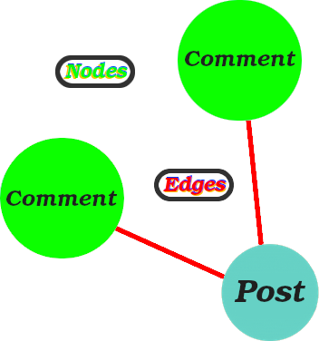

# Pagination

> [!NOTE]
>
> Different pagination models enable different client capabilities.

To traverse the relationship between sets of objects. we can have a field that returns a plural type:

```graphql
{
  post {
    id
    title
    comments {
      id
      content
      user {
        id
        username
      }
    }
  }
}
```

- Some fields return a list of values.
- Accept `first` and `after` to allow for specifying a specific region of a list.

  

  But this is not gonna cut it when our client needs to paginate. Here are some API designs we can have:

  1. `comments(first:2 offset:2)` returns the next two in the list.
  2. `comments(first:2 after:$commentId)` returns the next two after the last comment we fetched.
  3. `comments(first:2 after:$commentCursor)` returns the next two comments from where the cursor points to.

  [Cursor-based pagination](https://github.com/kasir-barati/nestjs-materials/blob/main/.github/docs/designing-restful-api/pagination.md#cursorBasedPagination) is the one we'll use.

## Cursor-based pagination in GraphQL

How can we send the cursor to the client?

- We obviously do not wanna add it to our `Comment` type.
- It is a property of the `comments`, not of the `post`.

## Relay cursor connections

- A generic specification for how a GraphQL server should expose paginated data.
- A predictable contract between the client & server.
- Might seems a bit complex but that's because it is so generalized.
  - Therefore we'll go through it step by step.
- "Connections" is a feature-rich pagination design pattern.
- [Relay](https://relay.dev/) knows how to work with "Connections" design pattern.

> [!TIP]
>
> **Lovely specification**:
>
> To ensure a consistent implementation of this pattern, we can take a loo at the [Relay Cursor Connections Specification](https://relay.dev/graphql/connections.htm).

### Add a new [layer of indirection](../glossary.md#indirectionDefinition)

- Our `comments` field should give us a list of edges.
- An edge has both:

  - A cursor.
  - The underlying node.

- We can also ask for additional information about the connection itself, e.g.:

  - How many comments is written for that post?
  - Is there more connections (comments to fetch)?
  - Etc.



> [!IMPORTANT]
>
> <a href="#paginationBuzzwords" id="paginationBuzzwords">#</a> Buzzwords:
>
> - **Connection** is the _paginated field_ on an object, e.g. `comments` in `post`.
> - Each **edge** has:
>   - Metadata About one object in the paginated list.
>   - A cursor to allow pagination starting from that object.
> - **Node**: represents the actual object user was looking for.
> - **pageInfo**:
>   - Lets the client know if there are more pages of data to fetch.
>   - In Relay spec it does NOT tell you the total number of items, because the client cache doesn’t need that info.
>     - But we can add it too through another field outside of `pageInfo`.
>
> To help you better understand the naming convention you can think of it as graph:
>
> 

### Why Were Connections Created?

- A very crucial existential question.
- To have a very efficient method of paging (learn more about efficiency [here](https://github.com/kasir-barati/sql/blob/main/docs/select/pagination.md)).
- To have a common nomenclature that is generic enough to encompass everything.

### Designing GraphQL Schema


- `PostCommentEdge` represents an actual entity in our graph.
- `PostCommentsConnection` type represents an abstract concept.
- In graph theory, an edge can have properties of its own which act effectively as metadata;
  - ```graphql
    enum CommentSentiment {
      NEUTRAL
      POSITIVE
      NEGATIVE
    }
    type PostCommentEdge {
      cursor: String!
      node: Comment
      sentiment: CommentSentiment
    }
    ```
  - **Note**: most tools treat the edge type as boilerplate. But we are not gonna do that, we add data that belongs to the edge to the `edge` type.

## Ref

1. [Pagination](https://graphql.org/learn/pagination/).
2. [Understanding pagination: REST, GraphQL, and Relay](https://www.apollographql.com/blog/understanding-pagination-rest-graphql-and-relay).
3. [Explaining GraphQL Connections](https://www.apollographql.com/blog/explaining-graphql-connections).
